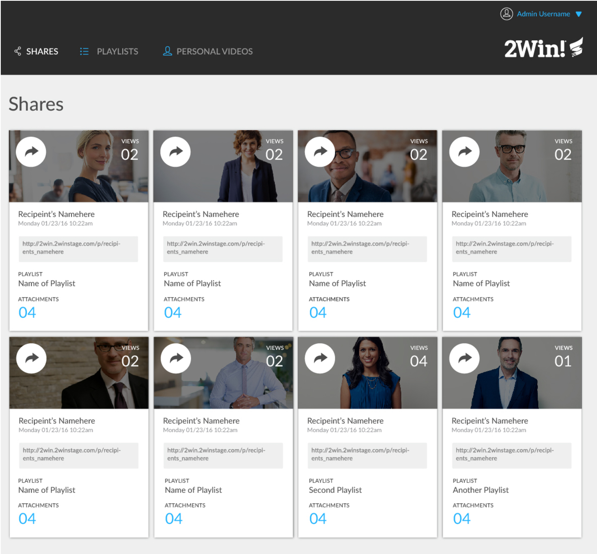
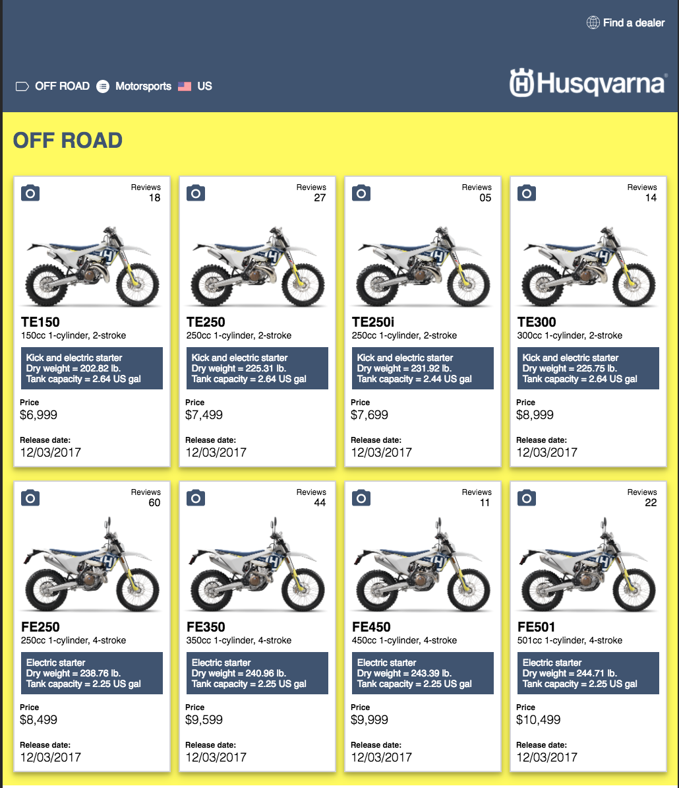

For this static comp, we were given a comp to recreate with our own interpretation of the layout. I decided to use the layout to display products
rather than videos or music. We had to make the site responsive all the way down to a small mobile layout. I used multiple break points and also used flexbox
to style my page. 

